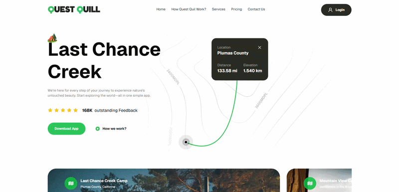

# Quest Quill

A modern camping and travel exploration application designed for hikers, climbers, and outdoor enthusiasts to plan trips and experience nature's untouched beauty.

🔗 **Live Demo:** [https://portfolio-traveling-app.vercel.app/](https://portfolio-traveling-app.vercel.app/)  
🌐 **Portfolio:** [https://github.com/aymenghris](https://github.com/aymenghris)  

## 📸 Preview

## ✨ Key Features
- **Responsive Design:** Fully responsive layout built using Tailwind CSS v4, optimized for a seamless viewing experience across mobile, tablet, and desktop screens.
- **Modular Component Architecture:** Highly organized structure separating components (`Hero`, `Camp`, `Guide`, `Features`, `GetApp`, `Footer`, `Navbar`) into clean, reusable folders.
- **Modern Tooling & Formatting:** Enforced code formatting, import organization, and Tailwind CSS utility class ordering using Biome.

## 🛠 Tech Stack
- Frontend: `Next.js 16` (App Router), `React 19`, `TypeScript`, `Tailwind CSS 4`, `shadcn/ui`
- Deployment: `Vercel`

## 👤 Contact
[LinkedIn](https://linkedin.com/in/aymenghris) • [Email](mailto:aymenghris@outlook.com) • [GitHub](https://github.com/aymenghris)
